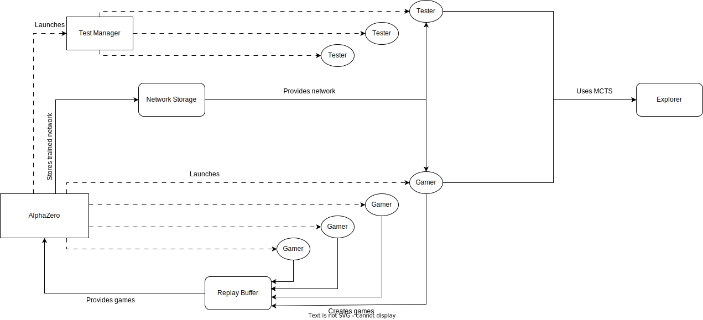

# NuZero

AlphaZero + DeepThinking + WarGames

This system was developed as an attempt to tackle the enormous complexity of Wargames, more specifically Standard Combat Series (SCS) games, by combining the AlphaZero learning capabilities with the Deepthinking extrapolation capacity. The general idea was to train recurrent networks on small/simple maps using AlphaZero and then use the techniques described in the Deepthinking papers to extrapolate the learned strategies to the very large maps of SCS games. The system ended up developing into a wider project to accommodate a larger set of games, network architectures and configurations. More information about the system and its conceptualization can be found in my [Master Thesis](www.google.com)

Most important papers for this project:
* [Hexagdly](https://www.semanticscholar.org/paper/HexagDLy-Processing-hexagonally-sampled-data-with-Steppa-Holch/817d9ae8f6843d56ce984fa2eccb95ce97de4720?sort=is-influential)
* [AlphaZero](https://www.semanticscholar.org/paper/A-general-reinforcement-learning-algorithm-that-and-Silver-Hubert/f9717d29840f4d8f1cc19d1b1e80c5d12ec40608)
* [DT1](https://www.semanticscholar.org/paper/Can-You-Learn-an-Algorithm-Generalizing-from-Easy-Schwarzschild-Borgnia/941612bd6750efa76e1a75bdc64b6e3d7ed66457)
* [DT2](https://www.semanticscholar.org/paper/End-to-end-Algorithm-Synthesis-with-Recurrent-Bansal-Schwarzschild/c9143b978f91ee35429f1644a2266e5b036dad3a)


## Features

* [X] Options for both sequential and fully asynchronous self-play, training and testing using [Ray](https://github.com/ray-project/ray).
* [X] Saves checkpoints during training and allows continuing previous training in case anything goes wrong.
* [X] Creates graphs for loss, win rates and others.
* [X] Allows defining custom games, network architectures and agents.
* [X] Tic Tac Toe and SCS games already implemented.
* [X] Definition of any custom SCS games within the already implemented rules.
* [X] Creation of custom SCS markers for units.
* [X] Already implemented network architectures for both hexagonal and orthogonal data.


### Future features

* [ ] Interface for training/testing-preset creation and saving
* [ ] Visual Interface for users to play SCS games
* [ ] Hyperparameter optimization
* [ ] Distributed training updates
* [ ] GPU optimization


## Getting started
### Installation

```bash
git clone https://github.com/guilherme439/NuZero
cd NuZero

pip install -r requirements.txt
```


### Training

In order to start training with a specific configuration, the training presets should be used.
Training presets are defined inside ```Run.py ```. 

```bash
python Run.py --training-preset 0 
```

As an example, training preset 0 trains a recurrent network for tic tac toe, using an optimized configuration, while the remaining presets are defined for SCS games.


### Testing
To test a trained network just use/define a testing preset. Currently, preset 0 tests and provides statistics for a pretrained tic tac toe model, while the remaing presets are used for SCS Games.

```bash
python Run.py --testing-preset 0
```

### Interactive

A command line interface is also available even though it does not support all the functionalities. The objective of this interface is giving new users a easy way to start using the system. To use it, simply run:
```bash
python Run.py --interactive
```
This will show you a series of prompts that will allow you to start training/testing by selecting from one of the available games, networks and configurations.

## Configs
In order to train the networks, both Training and Search configurations are required. These are located in Configs/Config_files/Training/ or Search/ respectively.

## Structure

The system can be ran in a variety of ways that can use different parts of the code, however these are the general responsibilities for each class:

Coordinators:
* AlphaZero - The main thread of the program. Responsible for training and plotting. Also launches the classes responsible for self-play.
* TestManager - Launches and manages the classes responsible for tests.

Workers: (usually several of these will run in parallel)

* Gamer - Plays individual self-play games.
* Test - Runs individual tests.

Others:
* Explorer - Contains the methods necessary to run MCTS both in self-play and testing.

This diagram gives a generic view of the code logic:

 

When running sequentially, the AlphaZero instance will launch Gamers to play a certain number of games. When they finish playing those games, they terminate and AlphaZero executes a training step. At the end of this training step the Gamers are once again launched and the cycle continues. On the other hand, if running fully asynchronously, the Gamers are launched only once and they will keep playing games indefinitely and filling the replay buffer. In the meanwhile the AlphaZero instance will be training the network and storing it. At the end of training, after a certain amount of training steps, AlphaZero will instruct the Gamers to stop playing and terminate.


If the system is ran with asynchronous testing, the Test Manager will start in a separate process and the AlphaZero instance will check for which tests have concluded at the end of each training step. Otherwise, tests will run sequentially, meaning that control will switch to the Test Manager while running tests, and self-play and training only continue after the tests finish.

It is only possible to run sequential testing, if the system is not running in fully asynchronous mode.


## Authors

* Guilherme Palma (guilherme.palma@tecnico.ulisboa.pt)

Publicly available alphazero pseudocode, as well as the deepthink github project were used as a base for some of the code and I also took ideas from other open-source AlphaGo/AlphaZero/MuZero implementations available on github.

